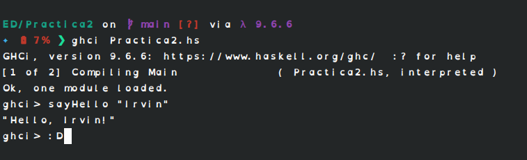

# Practica 02
#### Estructuras Discretas 2026-1
##### Jose Gabriel Gutierrez Guillen
 
1. ***Objetivo de la practica***
- Recordar y practicar lo visto en la clase de laboratorio creando funciones en **Haskell** y  retandonos a hacer funciones un poco mas complejas
2. ***Tiempo para completar la practica***
- 4 horas aproximadamente 
3. ***Comentarios sobre la practica***
- No tuve problemas para realizar los ejercicios del 1 al 10, fue muy facil y rapido, pero el ejercicio extra de cuadrdados fue confuso pues al intentar resolverlo con una tupla y sin usar recursion solo encontraba fallos hasta que logre completarlo usando una lista por comprensión

