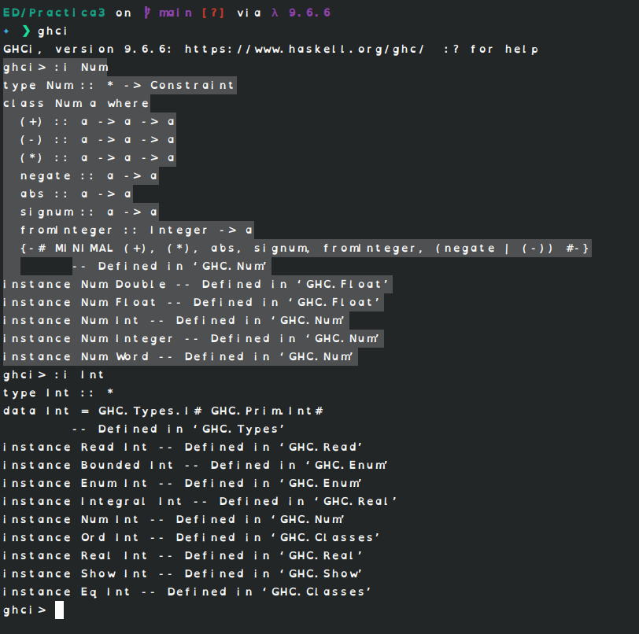

# Practica 03
#### Estructuras Discretas 2026-1
##### Jose Gabriel Gutierrez Guillen
 
1. ***Objetivo de la practica***
- Repasar lo aprendido en clase y aprender mas investigando por nuestra cuenta las soluciones a los ejercicios de la practica
2. ***Tiempo para completar la practica***
- 6 horas aproximadamente 
3. ***Comentarios sobre la practica***
- Primos y ConjuntoLista fueron bastante complicados pues necesitaba verificar condiciones que en una sola lista la dejaban vacia por lo que tuve que recurrir a usar funciones auxiliares y recursion para completarlos aunque no estuviera especificado en los lineamientos

Diferencia entre Num e Int
Int es un tipo de dato primitivo el cual tiene varias instancias una de ellas en Num la cual es una clase que define operaciones con dicho tipo de dato como: +,-,*
Captura de pantalla:

Recursión
La recursion se lleva a cabo cuando una funcion es definida consigo misma, osea que en la ejecucion de la funcion hay casos donde esta se usa a si misma para llegar a un resultado. usando casos base como las clausulas de escape o finalizacion de dicho ciclo para no tener un ciclo infinito.
En el video del pollito pio se podria tomar como caso base al pollito y se van invocando los animales hasta llegar al tractor el cual termina el ciclo