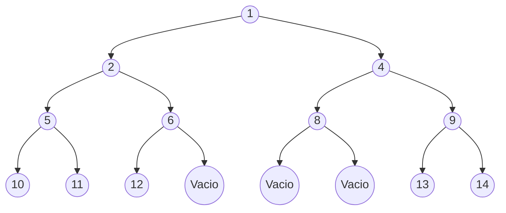
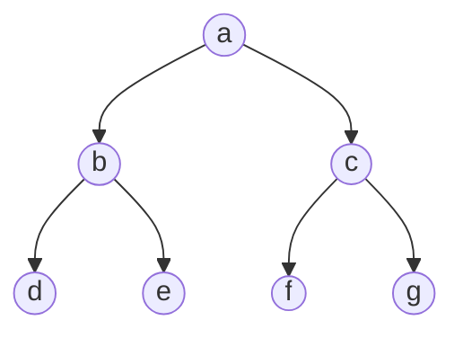
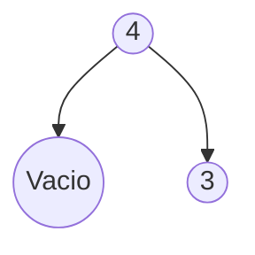
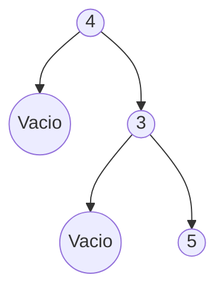

# Practica 06
#### Estructuras Discretas 2026-1
##### Jose Gabriel Gutierrez Guillen
 
1. ***Objetivo de la practica***
- Repasar lo aprendido en clase 
2. ***Descripcion de las funciones***
-**nVacios.** Como hemos visto en clase, las funciones recursivas sobre arboles siempre terminan cuando se llega al vacio entonces el caso base solo es devolver 1 cuando llegue al vacio y sumarlo con los demas en el caso recursivo
-**refleja.** Como en la funcion anterior, solo para cuando se llega al Vacio y devuelve Vacio pues el reflejo del Vacio es el Vacio y en el caso recursivo solo invocamos la funcion con los arboles en el orden inverso dejando la raiz intacta
-**minimo/maximo** El caso base es tener un Arbol con un solo elemento es decir tener un solo nodo, en ese caso solo devolvemos el elemento del nodo, porque el Vacio no es un Arbol. El caso recursivo es igual de simple, solo es usar la funcion min y max para ir comparando todos los elementos hasta que salga el mas pequeño o el mas grande
-**recorrido** Como ya habiamos hecho una funcion que recorria un arbol en posOrden solo la copie y pegue moviendo el elemento de la raiz a la izquierda y al centro, construyendo el tipo de dato Reco para identificar si es PreOrden, InOrden o PosOrden
-**esBalanceado** EL caso base es que el arbol este vacio por lo que el arbol este balanceado por otro lado el caso recursivo es calcular la altrua de ambos subarboles y luego ir restando 1 a 1 hasta que caiga en 3 casos, 1 0, 0 1, 0 0, en cualquiera de estos casos el arbol esta balanceado y devuelve True, cualquier otro valor que apaerzca es falso 
-**listaArbol** Este es el mas facil pues es muy parecido a quicksort, si la lista esta vacia devolvemos Vacio (caso Base) y si hay elementos (caso recursivo) usamos un filtro para poner los menores a la raiz a la izquierda y los mayores a la raiz a la derecha construyendo asi un arbol de busqueda
3. ***Tiempo para completar la practica***
- 5 horas aproximadamente 

# Arbol 1
-- (AB 1 (AB 2 (AB 5 (AB 10 Vacio Vacio) (AB 11 Vacio Vacio) (AB 6 (AB 12 Vacio Vacio) Vacio))) (AB 4 (AB 8 Vacio Vacio) (AB 9 (AB 13 Vacio Vacio) (AB 14 Vacio Vacio))))


# Arbol 2
-- (AB a (AB b (AB d Vacio Vacio) (AB e Vacio Vacio))  (AB c (AB f Vacio Vacio) (AB g Vacio Vacio)))


# Crea las representaciones visuales de los siguientes arboles
-- a) AB 4 (Vacio ) (AB 3 Vacio Vacio )


-- b) AB 4 Vacio (AB 3 Vacio (AB 5 Vacio Vacio))


-- c) AB 3 (AB 7 (AB 12 Vacio Vacio) Vacio) (AB 6 (AB 11 Vacio Vacio) (AB 10 Vacio Vacio))
```mermaid
graph TB
   graph TB
    A((3))-->B((7))
    B-->C((12))
    B-->D((Vacio))
    A-->E((6))
    E-->F((11))
    E-->G((10))
```


